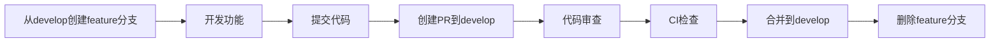
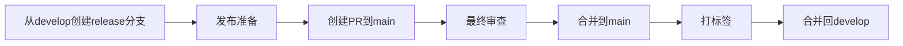
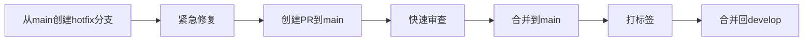

# 分支保护说明文档

## 概述

本文档描述智能知识系统项目的分支保护策略和配置规范，旨在确保代码质量和团队协作效率。

## 分支保护配置

### Main 分支保护

`main` 分支是生产环境代码所在分支，需要最高级别的保护。

#### GitHub 设置路径

```
Settings > Branches > Add branch protection rule
```

#### 配置项

| 配置项 | 状态 | 说明 |
|-------|------|------|
| Branch name pattern | `main` | 保护main分支 |
| Require a pull request | ✅ | 必须通过PR合并 |
| Require approvals | ✅ (1人) | 至少需要1人批准 |
| Dismiss stale reviews | ✅ | 代码更新后需重新审查 |
| Require review from CODEOWNERS | ✅ | 必须由代码所有者审查 |
| Require status checks | ✅ | 需要CI检查通过 |
| Require branches to be up to date | ✅ | 分支必须最新 |
| Block force pushes | ✅ | 禁止强制推送 |
| Do not allow bypassing | ✅ | 禁止绕过规则 |

#### 必需的状态检查

- `ci-test` - 单元测试
- `ci-lint` - 代码质量检查
- `ci-security` - 安全扫描
- `ci-build` - 构建检查

### Develop 分支保护

`develop` 分支是开发环境代码所在分支。

| 配置项 | 状态 | 说明 |
|-------|------|------|
| Branch name pattern | `develop` | 保护develop分支 |
| Require a pull request | ✅ | 必须通过PR合并 |
| Require approvals | ✅ (1人) | 至少需要1人批准 |
| Require status checks | ✅ | 需要CI检查通过 |
| Block force pushes | ✅ | 禁止强制推送 |

## 分支管理流程

### 功能开发流程



### 发布流程



### 紧急修复流程



## 分支命名规范

| 分支类型 | 命名模式 | 示例 |
|---------|---------|------|
| 功能开发 | `feature/<功能名>` | `feature/user-auth` |
| Bug修复 | `bugfix/<问题描述>` | `bugfix/login-error` |
| 紧急修复 | `hotfix/<版本号>-<描述>` | `hotfix/v1.2.1-memory-leak` |
| 发布 | `release/<版本号>` | `release/v1.3.0` |
| 重构 | `refactor/<模块名>` | `refactor/database-layer` |

## 权限管理

### 角色定义

| 角色 | 权限 | 说明 |
|-----|------|------|
| Owner | 全部权限 | 项目所有者 |
| Maintainer | 写入 + 管理 | 可修改保护规则、合并PR |
| Developer | 写入 | 可提交代码、创建PR |
| Contributor | 读取 | 只能Fork和提交PR |

### CODEOWNERS 配置

详见 [`.github/CODEOWNERS`](.github/CODEOWNERS) 文件。

## CI/CD 集成

### GitHub Actions 工作流

项目使用GitHub Actions实现自动化检查：

1. **PR创建时自动触发**
   - 代码格式检查
   - 单元测试执行
   - 覆盖率报告生成
   - 安全漏洞扫描

2. **检查失败处理**
   - PR无法合并
   - 通知开发者修复
   - 提供详细报告

## 最佳实践

### 开发者规范

1. **始终创建新分支**
   ```bash
   # 错误: 直接在main/develop上工作
   git checkout main

   # 正确: 从develop创建功能分支
   git checkout develop
   git pull origin develop
   git checkout -b feature/new-function
   ```

2. **保持分支更新**
   ```bash
   git checkout develop
   git pull origin develop
   git checkout feature/new-function
   git rebase develop
   ```

3. **分支完成后删除**
   - 合并后由作者或维护者删除
   - 保持仓库整洁

### 审查者规范

1. **及时响应审查请求**
   - 目标: 24小时内响应
   - 如无法及时审查，请通知团队

2. **提供建设性反馈**
   - 说明问题原因
   - 提供改进建议
   - 保持礼貌和尊重

3. **批准标准**
   - 代码质量符合规范
   - 测试覆盖充分
   - 文档更新完整
   - 无明显安全问题

## 监控和审计

### 分支保护状态检查

定期检查以下内容：

- [ ] 所有保护分支规则生效
- [ ] CODEOWNERS规则正确配置
- [ ] CI检查正常运行
- [ ] 无绕过保护规则的记录

### 审计日志

GitHub提供审计日志功能，可监控：

- 分支规则修改
- 强制推送尝试
- 保护规则绕过
- PR合并记录

## 故障处理

### 常见问题

**问题1: CI检查失败但本地测试通过**

```bash
# 清理并重新测试
git clean -fdx
pip install -r requirements.txt
pytest -v
```

**问题2: PR无法合并**

- 确保CI检查全部通过
- 确保有足够数量的批准
- 确保分支与目标分支同步

**问题3: 分支保护规则被绕过**

- 检查用户权限
- 查看审计日志
- 如非授权，立即撤销变更

## 相关文档

- [贡献指南](CONTRIBUTING.md)
- [PR模板](.github/PULL_REQUEST_TEMPLATE.md)
- [CODEOWNERS](.github/CODEOWNERS)
- [GitHub分支保护文档](https://docs.github.com/en/repositories/configuring-branches-and-merges-in-your-repository/defining-the-mergeability-of-pull-requests/about-protected-branches)
